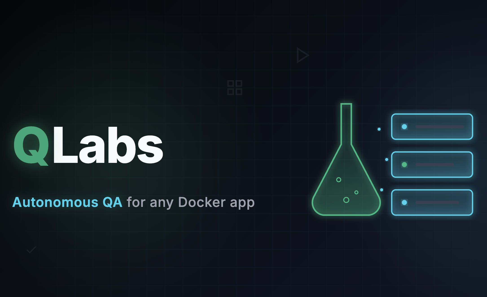

# 🔬 Q Labs 🌐

> Autonomous QA sandboxes for any Docker app — upload, run, fix, and re-run in minutes.
>
> Spin up isolated staging environments, run automatic route checks, and let an AI agent walk through your app.
>
> **Winner — Best hack for Demos and QA (Borderpass)** at [GenAI Genesis 2026](https://genaigenesis.ca/) (Canada's largest AI hackathon). $1,000 from BorderPass.

<!-- PROJECT SHIELDS -->
![Contributors][contributors-shield]
![Commits][commits-shield]
![Code Size][code-size-shield]
![Stars][stars-shield]
![MIT License][license-shield]

<!-- BANNER -->
<br />
<div align="center">
  
  <br /><br />
  <p>
    Q Labs turns any Docker image into an on-demand QA playground. Upload a container, define scenarios with rich seed data, run automatic smoke checks across real routes, and hand staging links to customers — or let an AI agent drive the app for you.
  </p>
</div>

## Table of Contents

- [How It Works](#how-it-works)
- [QA Run Results](#qa-run-results)
- [Auto QA & Sandboxes](#auto-qa--sandboxes)
- [Built With](#built-with)
- [Repository Layout](#repository-layout)
- [Getting Started](#getting-started)
- [Project Structure](#project-structure)
- [API Routes](#api-routes-selected)
- [Contact](#contact)

## How It Works

1. **Create an app** in the Q Labs control panel and **upload a Docker image** (`.tar`) as a version (e.g. `v1.0`, `v1.2.1`).
2. **Define scenarios** per version — each scenario is a staging definition: env vars, seed/config for data, and optional uploaded state (`.db`).
3. **Run Auto QA** — Q Labs launches a real container from that scenario, discovers routes from your app’s HTML, and hits them with GET requests. The report shows **green** (e.g. `GET / returned 200`) and **red** (e.g. `GET /cart returned 404`) so you see exactly what broke.
4. **Fix and re-run** — upload a new image as a new version (e.g. `v1.2.1`), run Auto QA again, and compare: same routes, new image, all green.
5. **Launch sandboxes** for any scenario — multiple apps can run at once. Each sandbox is an isolated container with its own data, ideal for **sales demos**: give customers a link to a live instance with curated, safe data.
6. **AI Agent** — point the agent at a sandbox and give it a task (e.g. “Add a product to the cart and go to checkout”). It reads the DOM, chooses clicks/typing/navigation, and steps through the real UI so you get repeatable, human-readable journeys.

## QA Run Results

Auto QA reports each checked path with a status. **Green** means the route returned HTTP 200; **red** means non-200 (e.g. 404, 500). The run is considered **passed** if every checked path returned 200, and **failed** if any path did not. The report shows a walkthrough of all paths and highlights only the failures so you can see exactly what broke between versions.

| Result | Meaning |
|--------|--------|
| Pass | All discovered/smoke routes returned 200 |
| Fail | At least one route returned non-200 |

## Auto QA & Sandboxes

- **Sandboxes** — Each scenario launch starts a real Docker container from the version's image. The container gets the scenario's env vars, optional seed DB, and a unique host port (e.g. 8001–8050). The control panel returns a URL to the running app; multiple sandboxes can run at once for different apps or scenarios.
- **Auto QA** — A one-off container is started from the same image and scenario. The runner fetches the app's root HTML, discovers links (or uses scenario `smoke_urls`), then sends GET requests to each path. Each response is recorded (e.g. `GET / returned 200`, `GET /cart returned 404`) and shown in the QA report with pass/fail and optional failure details.
- **AI Agent** — The agent receives the current DOM and your task. Anthropic Claude chooses the next action (click, type, navigate), and the control panel executes it in the sandbox. Steps are replayed in the real UI so you get shareable, human-readable walkthroughs.

## Built With

* [![Next.js][Next.js-badge]][Next-url]
* [![React][React-badge]][React-url]
* [![TypeScript][TypeScript-badge]][TypeScript-url]
* [![Tailwind CSS][Tailwind-badge]][Tailwind-url]
* [![Python][Python-badge]][Python-url]
* [![FastAPI][FastAPI-badge]][FastAPI-url]
* [![Docker][Docker-badge]][Docker-url]

And the services that power it:

- [Anthropic Claude](https://www.anthropic.com/) — AI agent that chooses next actions (click, type, navigate) from the DOM and your task.
- **control-panel-api** — FastAPI backend: apps, versions, scenarios, sandboxes, QA runs, AI agent, Docker container lifecycle, SQLite or IBM Db2.
- **control-panel-ui** — Next.js dashboard: upload images, manage scenarios, run Auto QA, view reports, launch sandboxes, drive the AI agent.
- **target-app-template** — Sample Next.js storefront (Faker.js–seeded) used as the canonical demo app; any Docker image on port 3000 can be used instead.
- **Docker** — All sandboxes and QA runs use real containers; images are tagged as `qlabs-{app_id}-{version_id}:latest`.

## Repository Layout

| Service | Stack | Port |
|---------|--------|------|
| `control-panel-ui` | Next.js, Tailwind, shadcn/ui | 3000 |
| `control-panel-api` | Python FastAPI, docker-py, SQLite/IBM Db2 | 8000 |
| `target-app-template` | Next.js, SQLite, Faker.js | 3000 (in containers, mapped 8001–8050) |
| `recruitment-management-app` | Next.js App Router, TypeScript | 3002 |

## Keyboard Shortcuts

The control panel does not define app-specific keyboard shortcuts. Use your browser’s usual shortcuts (e.g. refresh, back, tab navigation).

## Getting Started

### Prerequisites

- **Node.js** 20+
- **Python** 3.11+
- **Docker Engine** running locally

### Setup

```bash
git clone https://github.com/AdrianLuk12/genai-genesis-2026.git
cd genai-genesis-2026
```

**1. Build a Docker image to upload (optional — use included template)**

```bash
cd target-app-template
npm install
docker build -t qlabs-storefront-app .
docker save qlabs-storefront-app -o qlabs-storefront-app.tar
cd ..
```

**2. Control Panel API**

```bash
cd control-panel-api
python3 -m venv .venv
source .venv/bin/activate   # Windows: .venv\Scripts\activate
pip install -r requirements.txt
cp .env.example .env
```

Edit `.env` if needed. Key variables:

| Variable | Required | Description |
|----------|----------|-------------|
| `DOCKER_HOST` | No | Docker socket (default `unix:///var/run/docker.sock`) |
| `DB_PROVIDER` | No | `sqlite` (default) or `db2` |
| `ANTHROPIC_API_KEY` | For AI agent | Claude API key; omit if you won't use the agent |

See `control-panel-api/.env.example` for Db2 and optional `SHAREABLE_SANDBOX_BASE_URL` / `API_BASE_URL`. Then:

```bash
uvicorn app.main:app --reload --port 8000
```

API docs: [http://localhost:8000/docs](http://localhost:8000/docs)

**3. Control Panel UI** (in a new terminal)

```bash
cd control-panel-ui
npm install
cp .env.example .env
```

Set `NEXT_PUBLIC_API_URL=http://localhost:8000` in `.env`, then:
```bash
npm run dev
```

Open [http://localhost:3000](http://localhost:3000).

**4. (Optional) Seed demo QA runs**

```bash
cd control-panel-api
source .venv/bin/activate
python scripts/seed_qa_runs.py --init
```

### Run

With the API and UI running, create an app in the UI, upload your `.tar` as a version, add a scenario, and run **Auto QA** or **Launch** a sandbox.

### Troubleshooting

| Issue | What to try |
|-------|-------------|
| API won't start or sandbox fails | Ensure **Docker Engine** is running and the API can reach it (`DOCKER_HOST`). |
| Port 8000 or 3000 in use | Change the port: `uvicorn app.main:app --reload --port 8001` or `npm run dev -- -p 3001`, and set `NEXT_PUBLIC_API_URL` to match. |
| "Image not found" when launching sandbox | Upload the app's Docker image (`.tar`) as a version in the UI first, or ensure the image was built and saved with the expected tag. |
| AI agent doesn't respond | Set `ANTHROPIC_API_KEY` in `control-panel-api/.env` and restart the API. |

## Project Structure

```
Genai-genesis/
├── control-panel-api/
│   ├── app/
│   │   ├── main.py          # Apps, versions, scenarios, sandboxes, QA runs, AI agent
│   │   └── db.py            # SQLite / Db2 init and helpers
│   ├── scripts/
│   │   ├── seed_qa_runs.py  # Seed demo QA runs and app/versions
│   │   └── complete_qa_run.py  # Mark a stuck QA run as completed
│   ├── data/                # platform.db, scenario_files, app_images (created at runtime)
│   └── requirements.txt
├── control-panel-ui/
│   └── src/
│       ├── app/
│       │   ├── page.tsx     # Dashboard
│       │   ├── apps/        # App list and version/scenario management
│       │   ├── qa/          # QA runs list and report
│       │   ├── agent/       # AI Agent UI
│       │   └── live/        # Live sandboxes
│       └── components/
├── target-app-template/    # Demo storefront (Docker image for sandboxes)
│   ├── src/
│   │   ├── app/             # Next.js App Router pages and API routes
│   │   └── lib/             # seed.ts (Faker), db
│   └── Dockerfile
├── recruitment-management-app/  # Optional second demo app
└── openspec/                # Specs and change history
```

## API Routes (selected)

| Method | Endpoint | Description |
|--------|----------|-------------|
| `GET` | `/api/health` | API + Docker status |
| `GET` / `POST` | `/api/apps` | List or create apps |
| `GET` / `POST` | `/api/apps/{id}/versions` | List versions or upload Docker image (multipart) |
| `GET` / `POST` | `/api/scenarios` | List or create scenarios (`?app_version_id=`) |
| `POST` | `/api/sandboxes` | Launch sandbox for a scenario |
| `GET` / `DELETE` | `/api/sandboxes` / `/api/sandboxes/{id}` | List or destroy sandboxes |
| `POST` | `/api/apps/{version_id}/qa-run` | Start an Auto QA run |
| `GET` | `/api/qa-runs` / `/api/qa-runs/{id}` | List runs or get run detail with results |
| `POST` | `/api/agent/next-action` | AI agent: next action (click/type/navigate) given DOM + intent |

## Contact

If you would like to find out more about Q Labs, feel free to reach out on LinkedIn:

- Adrian Luk — [LinkedIn](https://www.linkedin.com/in/adrian-ctluk/)
- Bryant Ruan — [LinkedIn](https://www.linkedin.com/in/bryant-ruan/)
- Peizhe Guan — [LinkedIn](https://www.linkedin.com/in/peizhe-guan/)

Or, to see our submission to [GenAI Genesis](https://genai-genesis-2026.devpost.com/), feel free to check out our [Devpost](https://devpost.com/software/q-labs) submission!

## License

Distributed under the MIT License. See [`LICENSE`](LICENSE) for more information.

<!-- MARKDOWN LINKS & IMAGES -->
[contributors-shield]: https://img.shields.io/github/contributors/AdrianLuk12/genai-genesis-2026.svg?style=for-the-badge
[commits-shield]: https://img.shields.io/github/commit-activity/t/AdrianLuk12/genai-genesis-2026.svg?style=for-the-badge
[code-size-shield]: https://img.shields.io/github/languages/code-size/AdrianLuk12/genai-genesis-2026.svg?style=for-the-badge
[stars-shield]: https://img.shields.io/github/stars/AdrianLuk12/genai-genesis-2026.svg?style=for-the-badge
[license-shield]: https://img.shields.io/github/license/AdrianLuk12/genai-genesis-2026.svg?style=for-the-badge
[Next.js-badge]: https://img.shields.io/badge/next.js-000000?style=for-the-badge&logo=nextdotjs&logoColor=white
[Next-url]: https://nextjs.org/
[React-badge]: https://img.shields.io/badge/react-61DAFB?style=for-the-badge&logo=react&logoColor=black
[React-url]: https://react.dev/
[TypeScript-badge]: https://img.shields.io/badge/typescript-3178C6?style=for-the-badge&logo=typescript&logoColor=white
[TypeScript-url]: https://www.typescriptlang.org/
[Tailwind-badge]: https://img.shields.io/badge/tailwind_css-06B6D4?style=for-the-badge&logo=tailwindcss&logoColor=white
[Tailwind-url]: https://tailwindcss.com/
[Python-badge]: https://img.shields.io/badge/python-3776AB?style=for-the-badge&logo=python&logoColor=white
[Python-url]: https://www.python.org/
[FastAPI-badge]: https://img.shields.io/badge/fastapi-009688?style=for-the-badge&logo=fastapi&logoColor=white
[FastAPI-url]: https://fastapi.tiangolo.com/
[Docker-badge]: https://img.shields.io/badge/docker-2496ED?style=for-the-badge&logo=docker&logoColor=white
[Docker-url]: https://www.docker.com/
